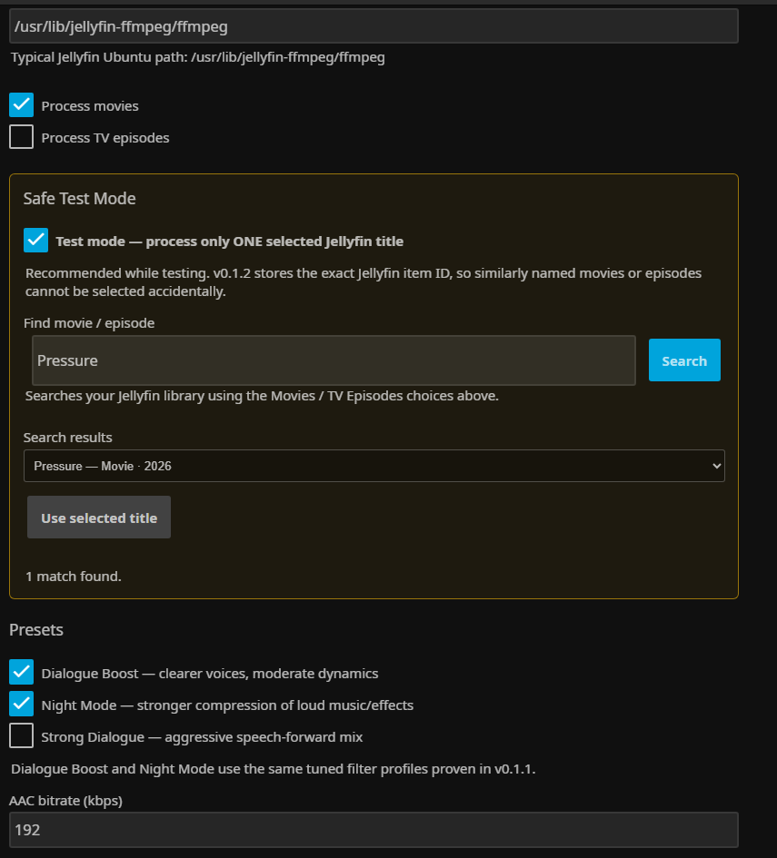
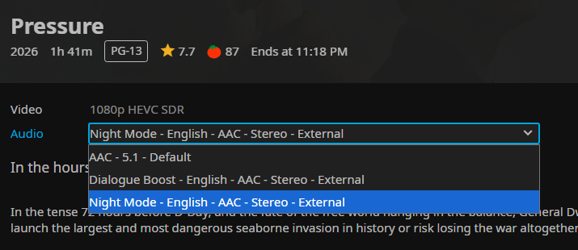
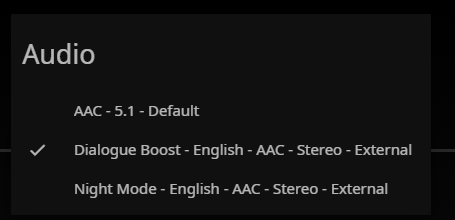

# Guru Audio Enhancer for Jellyfin 12

Guru Audio Enhancer is a server-side Jellyfin plugin that creates **optional dialogue-enhanced audio tracks** for movies and TV episodes.

It is aimed at a common home-theatre problem: dialogue is too quiet while music, explosions and effects are much louder. Instead of modifying Jellyfin clients or replacing the original soundtrack, the plugin uses Jellyfin's FFmpeg installation to create external AAC sidecar tracks that appear in Jellyfin's normal **Audio** selector.

> **Status:** early community release, v0.1.2.0. Tested on Jellyfin 12.x / .NET 10.



## What it creates

For a movie such as:

```text
Pressure.2026.mp4
```

Guru Audio Enhancer can create:

```text
Pressure.2026.Dialogue Boost.eng.aac
Pressure.2026.Night Mode.eng.aac
Pressure.2026.Strong Dialogue.eng.aac
```

Jellyfin discovers these as ordinary external audio streams. The original video and original audio are never replaced or modified.



The tracks are also selectable during playback in Jellyfin Media Player:



## Presets

| Preset | Purpose |
| --- | --- |
| **Dialogue Boost** | Brings voices forward while retaining moderate dynamics. Recommended first choice. |
| **Night Mode** | Adds stronger dynamic-range compression so loud music/effects are closer in level to dialogue. |
| **Strong Dialogue** | More aggressive speech-forward processing for difficult mixes or small TV speakers. |

For 5.1/7.1 sources the downmix deliberately gives extra weight to the centre channel, where film dialogue is commonly concentrated. Stereo and unusual channel layouts are converted to stereo before the dialogue-processing chain is applied.

## Features

- Jellyfin 12.x / .NET 10 support.
- Movies and TV episodes.
- Dialogue Boost, Night Mode and Strong Dialogue presets.
- AAC output from 96 to 320 kbps.
- Uses the server's Jellyfin FFmpeg installation.
- Safe Test Mode for one exact Jellyfin library item.
- Search/selection by exact Jellyfin Item ID, avoiding accidental similarly named titles.
- Scheduled Tasks for generation and cleanup.
- Existing generated tracks are skipped unless overwrite is explicitly enabled.
- Optional exclusion of non-local / URL media.
- Original media files remain untouched.

## Current limitations

This is an early release and intentionally keeps the processing path simple.

- Only the **first audio stream** (`0:a:0`) is processed.
- Generated tracks are **stereo AAC**, even when the source is 5.1 or 7.1.
- The plugin currently writes sidecar audio into the **same directory as the media file**. The Jellyfin service account therefore needs write permission to that directory.
- A library refresh/scan may be needed before newly generated external tracks appear in clients.
- Processing is offline, not real-time. CPU speed, source codec and movie length determine generation time.
- English (`eng`) is currently used in the generated sidecar filename.

Multi-language/source-stream selection and additional output options are planned for later releases.

## Disk usage

Only audio is generated; the video is not duplicated. At 192 kbps AAC, a 100-minute track is roughly 144 MB. Enabling two presets roughly doubles that additional storage.

## Installation

### Plugin repository (recommended after the first GitHub release)

1. Open **Jellyfin Dashboard → Plugins → Repositories**.
2. Add the raw URL to this repository's `manifest.json`:

   ```text
   https://raw.githubusercontent.com/<YOUR_GITHUB_USER>/jellyfin-plugin-guru-audio-enhancer/main/manifest.json
   ```

3. Open the plugin catalog and install **Guru Audio Enhancer**.
4. Restart Jellyfin.

The release workflow in this repository automatically populates `manifest.json` when a version tag is published.

### Manual installation

1. Download the latest release ZIP.
2. Extract the contents into a dedicated plugin directory, for example:

   ```text
   /var/lib/jellyfin/plugins/GuruAudioEnhancer/
   ```

3. Restart Jellyfin.

On a standard Debian/Ubuntu installation the plugin directory is normally under `/var/lib/jellyfin/plugins/`. Other installations, including Docker, may use a different Jellyfin data path.

## First-run recommendation

Do **not** begin by processing the whole library.

1. Open **Dashboard → Guru Audio Enhancer**.
2. Leave **Safe Test Mode** enabled.
3. Search for a movie or episode with a known dialogue/music imbalance.
4. Select the exact result and click **Use selected title**.
5. Enable **Dialogue Boost** and optionally **Night Mode**.
6. Save settings.
7. Run **Dashboard → Scheduled Tasks → Guru Audio Enhancer → Generate enhanced dialogue audio**.
8. Refresh/scan that item in Jellyfin.
9. Compare the original, Dialogue Boost and Night Mode tracks at the same master volume.

Once satisfied with the result, Test Mode can be disabled for batch processing.

## FFmpeg

The typical Jellyfin Ubuntu path is:

```text
/usr/lib/jellyfin-ffmpeg/ffmpeg
```

The path is configurable in the plugin settings.

## Build from source

Requirements:

- .NET 10 SDK
- Jellyfin 12.x NuGet packages (restored automatically)
- `zip` for creating a local install package

Linux/macOS:

```bash
chmod +x build.sh
./build.sh
```

Windows PowerShell:

```powershell
./build.ps1
```

The DLL is produced under `publish/`. If `zip` is available, an installable ZIP is also created under `dist/`.

## Releases

Releases are automated. Maintainers normally only need to create and push a four-part version tag:

```bash
git tag v0.1.2.0
git push origin v0.1.2.0
```

The GitHub Actions release workflow will:

1. Build the plugin with .NET 10.
2. Generate `meta.json`.
3. Package the DLL, metadata and plugin artwork.
4. Create a GitHub Release and upload the ZIP.
5. Calculate the MD5 checksum expected by Jellyfin plugin repositories.
6. Update `manifest.json` on `main` with the new release.

See [docs/GITHUB_SETUP.md](docs/GITHUB_SETUP.md) and [docs/RELEASE_CHECKLIST.md](docs/RELEASE_CHECKLIST.md).

## Development notes

- Plugin GUID: `61a21ab4-b0c7-4e18-92d1-42f8495ed131`
- Target ABI: `12.0.0.0`
- Target framework: `net10.0`
- Main assembly: `Jellyfin.Plugin.GuruAudioEnhancer.dll`

The code follows the normal Jellyfin plugin model: a server plugin, configuration page, dependency-injection service registration and scheduled tasks. It does not inject code into Jellyfin clients.

## Safety and data handling

The plugin does not contact an external service and does not upload media. Audio processing is performed locally by FFmpeg on the Jellyfin server.

Generation writes new `.aac` files beside the media. The cleanup scheduled task deletes only the plugin's known generated filename variants. Backups and careful testing are still recommended before large batch operations.

## Support / bug reports

When reporting a problem, please include:

- Jellyfin Server version.
- Plugin version.
- Operating system / Docker information.
- Source audio codec and channel layout if known.
- Relevant Jellyfin log lines containing `Guru Audio Enhancer`.
- Whether the problem occurs in Test Mode or batch mode.

Please do not attach copyrighted media files to public issues.

## License

GPL-3.0. See [LICENSE](LICENSE).

## Project status / affiliation

Guru Audio Enhancer is an independent community plugin and is **not an official Jellyfin project plugin**. Jellyfin is a trademark of its respective project/community.
